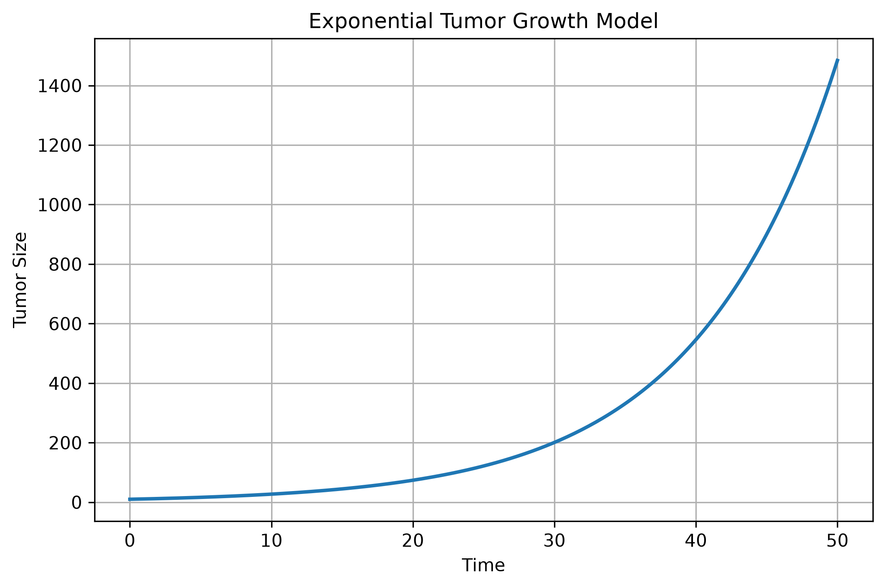
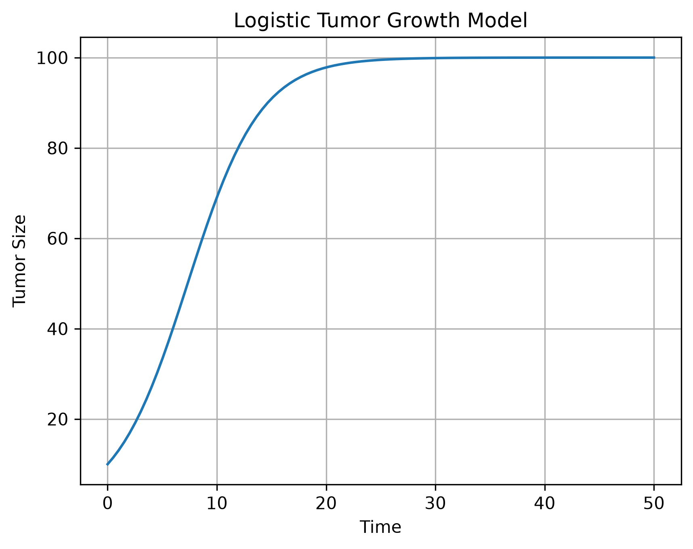
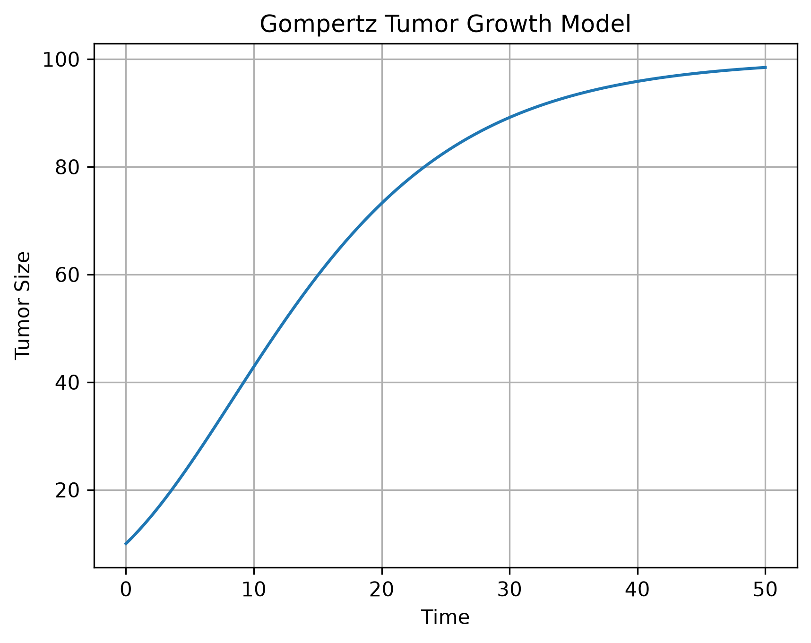
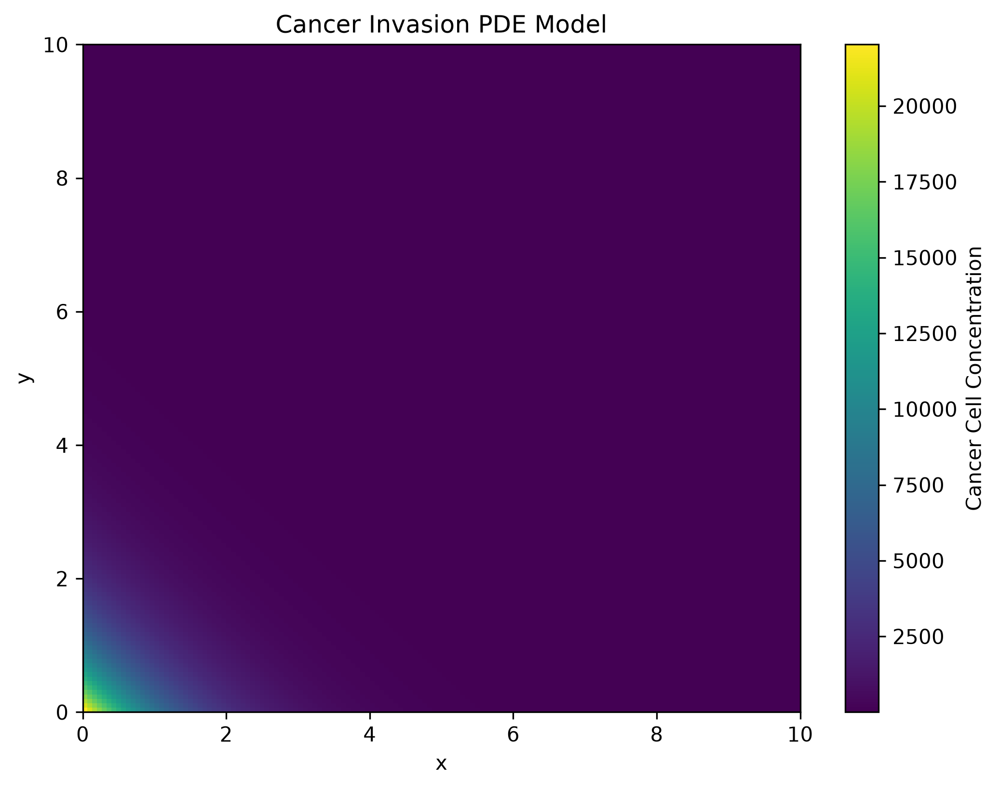
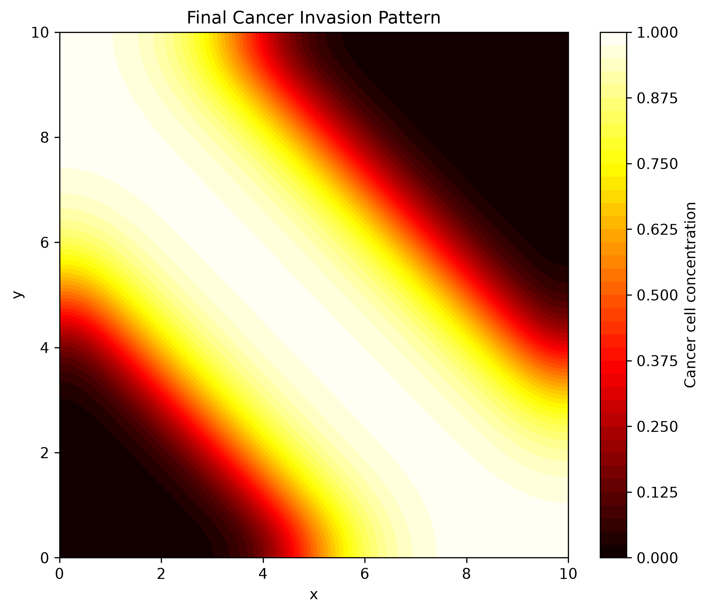

# 🧬 Quantitative Analysis of Tumor Evolution Using Mathematical Models

A Python-based mathematical modeling project for studying *tumor growth, treatment effects, and cancer invasion* using computational simulations and scientific visualization.

---

## 📌 Project Overview

Tumor growth is a complex biological process influenced by cell proliferation, environmental limitations, treatment, and spatial invasion.

This project implements different mathematical models to study tumor evolution and uses Python to numerically simulate and visualize their behavior.

### Models Implemented

1. Exponential Growth Model
2. Logistic Growth Model
3. Gompertz Growth Model
4. Dynamic Carrying Capacity Model
5. Tumor Treatment Model
6. Cancer Invasion PDE Model
7. Anderson Cancer Invasion PDE Model

---

# 🎯 Objectives

The main objectives of this project are:

- To understand mathematical modeling of tumor growth.
- To implement tumor-growth models using Python.
- To study different patterns of tumor evolution.
- To visualize model behavior through graphs.
- To understand the effect of environmental limitations on tumor growth.
- To study the effect of treatment on tumor growth.
- To understand spatial cancer invasion.
- To compare different tumor-growth models.
- To develop practical skills in Python and scientific computing.

---

# 🧮 Models and Interpretation

## 1. Exponential Growth Model

The exponential growth model represents tumor growth when the tumor population increases continuously without considering environmental limitations.

### Interpretation

- Tumor growth is initially rapid.
- The growth rate depends on the current tumor size.
- Environmental limitations are not considered.
- The model is useful for understanding early-stage or unrestricted growth behavior.
- Long-term growth can become unrealistically large because no carrying capacity is included.

### Graph



---

## 2. Logistic Growth Model

The logistic growth model considers environmental limitations by introducing a maximum sustainable tumor size.

### Interpretation

- Tumor growth is rapid during the early stage.
- Growth gradually slows as the tumor becomes larger.
- Environmental limitations affect tumor growth.
- The tumor approaches a stable maximum level called the carrying capacity.
- This model provides a more realistic representation of limited tumor growth than the exponential model.

### Graph



---

## 3. Gompertz Growth Model

The Gompertz model represents tumor growth where the growth rate gradually decreases as the tumor becomes larger.

### Interpretation

- Growth is relatively rapid when the tumor is small.
- Growth slows progressively as tumor size increases.
- The model produces a characteristic curved growth pattern.
- It is useful for representing tumor growth that does not remain exponential indefinitely.
- The tumor approaches a limiting size over time.

### Graph



---

## 4. Dynamic Carrying Capacity Model

The dynamic carrying capacity model extends the idea of logistic growth by allowing the environmental capacity of the tumor to change.

### Interpretation

- The tumor's growth environment is not assumed to remain constant.
- Changes in nutrients, oxygen, blood supply, and tissue conditions can influence tumor growth.
- The carrying capacity can change as the biological environment changes.
- This provides a more flexible representation of tumor development.
- The model demonstrates the interaction between tumor growth and its changing environment.

### Graph


---

## 5. Tumor Treatment Model

The tumor treatment model incorporates the effect of treatment into tumor-growth behavior.

### Interpretation

- Tumor cells continue to have natural growth tendencies.
- Treatment introduces an additional effect that reduces tumor growth.
- Increasing treatment effectiveness can produce a stronger reduction in tumor size.
- The model helps visualize how treatment can alter tumor-growth behavior.
- This is a simplified mathematical representation and does not represent an actual clinical treatment protocol.

### Graph


---

## 6. Cancer Invasion PDE Model

The cancer invasion model extends tumor modeling from time-dependent growth to spatial behavior.

### Interpretation

- Cancer cells can move through surrounding tissue.
- The model considers both cell movement and cell proliferation.
- Tumor-cell density can vary from one location to another.
- The simulation demonstrates how cancer cells can spread spatially.
- PDE-based models are useful for studying the spatial progression of cancer invasion.

### Graph



---

## 7. Anderson Cancer Invasion PDE Model

The Anderson cancer invasion model provides a mathematical framework for studying the spatial behavior of cancer cells and their invasion into surrounding tissue.

### Interpretation

- The model considers spatial tumor-cell behavior.
- Cancer-cell movement and proliferation can contribute to invasion.
- Tumor-cell density can change across different locations.
- The model helps visualize how cancer invasion can develop over space and time.
- It provides a computational approach for studying spatial cancer progression.

### Graph



---

# 📊 Model Comparison

| Model | Type | Main Purpose |
|---|---|---|
| Exponential Growth | ODE | Study unrestricted tumor growth |
| Logistic Growth | ODE | Study growth with environmental limitations |
| Gompertz Growth | ODE | Study decreasing tumor growth rate |
| Dynamic Carrying Capacity | ODE System | Study changing environmental conditions |
| Tumor Treatment | ODE | Study treatment effects on tumor growth |
| Cancer Invasion | PDE | Study spatial cancer-cell invasion |
| Anderson Cancer Invasion | PDE | Study spatial tumor progression |

---

# 🔬 Methodology

The project follows a computational mathematical-modeling workflow.

### 1. Model Selection

Different mathematical models are selected to represent different aspects of tumor evolution.

### 2. Parameter Definition

Appropriate model parameters and initial conditions are defined for each simulation.

### 3. Numerical Computation

Python is used to solve and simulate the mathematical models numerically.

### 4. Data Generation

The simulations generate numerical results describing tumor growth or spatial tumor behavior.

### 5. Visualization

Matplotlib is used to convert the simulation results into graphs.

### 6. Interpretation

The generated graphs are analyzed to understand the behavior of each model.

### 7. Comparison

The models are compared to understand how different assumptions produce different tumor-growth patterns.

---

# 🛠️ Technologies Used

- *Python 3*
- *NumPy*
- *SciPy*
- *Matplotlib*
- *SymPy*
- *Visual Studio Code*
- *Git*
- *GitHub*

---

# 📁 Project Structure

```text
tumor-growth-mathematical-models/
│
├── graphs/
│   ├── exponential_growth.png
│   ├── logistic_growth.png
│   ├── gompertz_growth.png
│   ├── dynamic_carrying_capacity_model.png
│   ├── tumor_treatment_model.png
│   ├── cancer_invasion_pde_model.png
│   └── anderson_cancer_invasion_pde.png
│
├── exponential_growth_model.py
├── logistic_growth_model.py
├── gompertz_growth_model.py
├── dynamic_carrying_capacity_model.py
├── tumour_treatment_model.py
├── cancer_invasion.py
├── anderson_cancer_invasion_pde.py
│
├── README.md
└── requirements.txt

Results

The simulations demonstrate different patterns of tumor evolution.

Exponential Growth
Shows continuous and rapid tumor growth when environmental limitations are ignored.

Logistic Growth
Shows rapid initial growth followed by stabilization due to environmental limitations.

Gompertz Growth
Shows rapid early growth followed by a gradual reduction in growth rate.

Dynamic Carrying Capacity
Shows how changes in environmental conditions can influence tumor growth.

Tumor Treatment
Shows how treatment can alter the natural growth behavior of a tumor.

Cancer Invasion PDE
Shows spatial spreading of cancer cells together with tumor-cell proliferation.

Anderson Cancer Invasion PDE
Shows spatial cancer-cell behavior and invasion through computational simulation.


🎓 Learning Outcomes


Through this project, the following concepts were explored:
Mathematical modeling
Tumor-growth modeling
Ordinary Differential Equations
Partial Differential Equations
Numerical methods
Numerical simulation
Exponential growth
Logistic growth
Gompertz growth
Carrying capacity
Dynamic systems
Tumor treatment modeling
Cancer invasion
Reaction-diffusion concepts
Scientific visualization
Python programming
NumPy
SciPy
Matplotlib
SymPy
Git and GitHub


🌱 Future Improvements
The project can be extended by incorporating:
Tumor angiogenesis
Immune-cell interactions
Chemotherapy scheduling
Radiotherapy effects
Drug diffusion
Oxygen availability
Nutrient availability
Multiple tumor-cell populations
2D tumor simulations
3D tumor simulations
Experimental data
Parameter estimation
Interactive visualization
Advanced cancer-invasion models


🎯 Project Highlights
7 mathematical tumor and cancer-invasion models
ODE and PDE-based simulations
Python-based numerical computation
Scientific visualization
Tumor-growth analysis
Treatment-effect modeling
Spatial cancer-invasion modeling
Graph-based interpretation
Organized project structure
GitHub documentation


👩‍💻 Author
Shravani
Project Title
Quantitative Analysis of Tumor Evolution Using Mathematical Models
This project combines mathematical modeling, Python programming, numerical computation, differential equations, and scientific visualization to study tumor evolution and cancer invasion.


⚠️ Disclaimer
This project is developed for academic and educational purposes.
The models are simplified mathematical representations of complex biological processes and should not be used for medical diagnosis, treatment decisions, or clinical prediction.


⭐ Conclusion
This project demonstrates how mathematical models and computational techniques can be used to study different aspects of tumor evolution.
By comparing multiple models, the project provides an understanding of how tumor growth, environmental limitations, treatment effects, and spatial cancer invasion can be represented computationally 